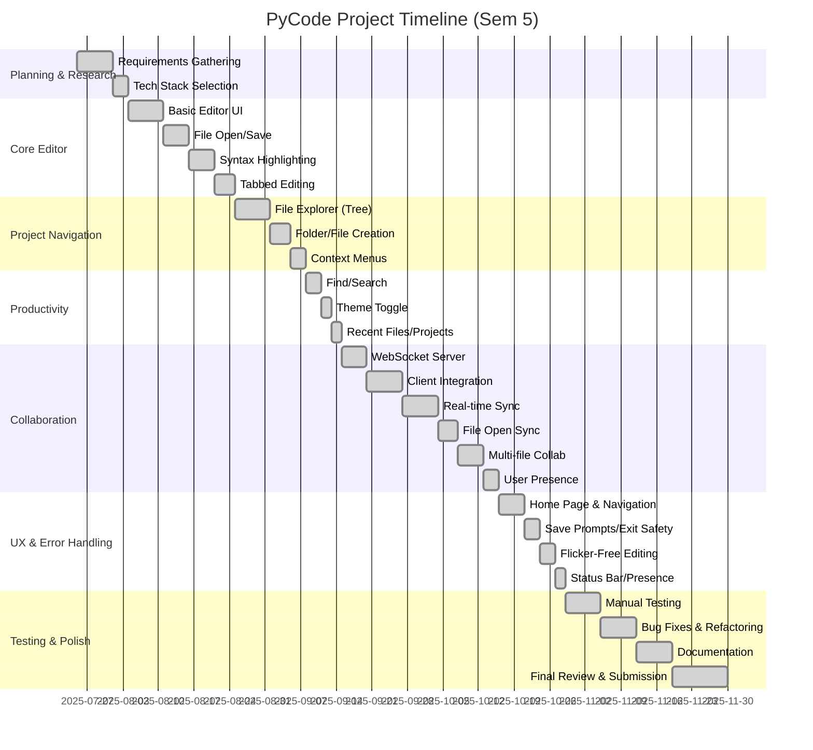

# PyCode Collaborative Editor

## Semester 5 Project
This project was developed as part of the Semester 5 curriculum. It demonstrates advanced concepts in collaborative software, real-time networking, and modern UI/UX design using Python and PyQt5.

---

## ⚠️ Note on Diagrams
**GitHub does not natively render Mermaid diagrams in README files.**
- To view the architecture and Gantt charts, use a local Markdown viewer that supports Mermaid, or paste the diagram code into [mermaid.live](https://mermaid.live/).

---

## Known Failures & Limitations

### 1. Live Editing Not Always Working Reliably
- **Symptom:** Sometimes, when two users edit the same file in the same session, changes are not reflected in the other editor, or only one direction works.
- **Where:**
    - `code_editor.py`: `on_editor_text_changed_collab`, `apply_collab_update`, `on_collab_message`, `connect_editor_signal`
    - `collab_server.py`: `handler` function, session/user management
- **Why:**
    - The current implementation sends the full file content on every change, and only for the currently active tab. If users open different files or tabs, or if the signal is not connected properly (e.g., after switching tabs), updates may not be sent or received.
    - There is no operational transform (OT) or CRDT logic, so concurrent edits can overwrite each other or cause race conditions.
    - The WebSocket client may not always reconnect or handle dropped connections robustly.
- **What would fix it:**
    - Implementing per-cursor/line sync, or using an OT/CRDT library for true concurrent editing.
    - Ensuring the signal is always connected for the current tab, and that all file open/close events are broadcast.
    - Adding robust reconnection and error handling in the WebSocket client.

### 2. Cursor/Selection Sync Not Implemented
- **Symptom:** You cannot see where other users' cursors are, so it's easy to overwrite each other's work.
- **Where:** Not implemented in any class yet.
- **Why:** Would require sending cursor position and selection info with each edit, and rendering remote cursors in the editor.
- **What would fix it:**
    - Add cursor/selection sync messages and UI rendering for remote cursors.

### 3. No Username/Avatar Support
- **Symptom:** Users are only identified by UUIDs in the status bar.
- **Where:** `collab_server.py` (session/user management), `code_editor.py` (status bar)
- **Why:** No prompt for username, and no logic to send/display names or avatars.
- **What would fix it:**
    - Prompt for username on join, send to server, and broadcast/display in UI.

### 4. No Integrated Chat or Comments
- **Symptom:** No way to chat or leave comments in a session.
- **Where:** Not implemented.
- **Why:** Out of scope for MVP.
- **What would fix it:**
    - Add a chat panel and message types for chat.

### 5. No Cloud/Remote Server Support
- **Symptom:** Collaboration only works on localhost.
- **Where:** `collab_server.py` (hardcoded to localhost)
- **Why:** For simplicity and local testing.
- **What would fix it:**
    - Deploy the server to a public host and update the client connection URL.

### 6. Error Handling for File Encoding
- **Symptom:** Opening non-UTF-8 files can cause decode errors.
- **Where:** `open_file_by_path` in `code_editor.py`
- **Why:** Always tries to open files as UTF-8.
- **What would fix it:**
    - Add encoding detection or fallback to other encodings.

---

## Why These Failures Occur
- **Concurrency:** Real-time collaborative editing is a hard problem; without OT/CRDT, race conditions and overwrites are common.
- **Signal Management:** PyQt signals must be carefully managed when switching tabs or files; missing a connection means no sync.
- **MVP Focus:** Some features (chat, usernames, remote server) were out of scope for the initial semester project.
- **Error Handling:** Some edge cases (file encoding, reconnects) require more robust handling for production use.

---

## Project Timeline (July 25, 2025 – November 30, 2025)

### Gantt Chart

### Module/Feature Breakdown
- **July 25 – Aug 3:** Requirements, research, and technology selection
- **Aug 4 – Aug 24:** Core editor UI, file open/save, syntax highlighting, tabs
- **Aug 25 – Sep 7:** File explorer, folder/file creation, context menus
- **Sep 8 – Sep 14:** Find/search, theme toggle, recent files
- **Sep 15 – Oct 15:** WebSocket server, client integration, real-time sync, file open sync, multi-file collab, user presence
- **Oct 16 – Oct 29:** Home page, navigation, save prompts, flicker-free editing, status bar
- **Oct 29 – Nov 18:** Manual testing, bug fixes, refactoring, documentation
- **Nov 19 – Nov 30:** Final review, polish, and submission

---

## Design Decisions & Rationale
- **PyQt5 + QScintilla:** Chosen for robust cross-platform GUI and advanced code editing features.
- **WebSocket-based Collaboration:** Enables real-time, low-latency sync for multiple users.
- **Tabbed UI:** Familiar, VSCode-like experience for users.
- **Tree-based File Explorer:** Allows intuitive navigation and file management.
- **Signal/Slot Architecture:** Ensures thread safety and responsive UI.
- **Status Bar for Presence:** Non-intrusive, always-visible user info.
- **Flicker-Free Editing:** Only update editor if content changes, preserve cursor.
- **Safe Exit/Save Prompts:** Prevents accidental data loss.
- **Home Page:** Central hub for project/session management.

---

## UI/UX Choices
- **Modern, clean look:** Large title, clear buttons, dark/light themes.
- **Context menus:** Right-click for file/folder actions.
- **Recent files/projects:** Quick access from home page.
- **Copy session link:** One-click copy for easy sharing.
- **Status bar:** Shows user presence and session info.
- **Responsive layout:** Editor and explorer resize smoothly.

---

## Error Handling & Edge Cases
- **WebSocket disconnects:** Handles server disconnects gracefully.
- **Thread safety:** All UI updates from background threads use signals.
- **File encoding:** Opens files as UTF-8, with error handling for decode errors.
- **Unsaved changes:** Prompts user before closing tabs or exiting.
- **Invalid session links:** Handles join errors with user feedback.

---

## Testing & Quality Assurance
- **Manual testing:** All features tested with multiple users and files.
- **Edge case testing:** File open/close, rapid edits, disconnect/reconnect.
- **Bug tracking:** Issues logged and resolved during development.
- **Code review:** Peer review of major modules and refactors.
- **Documentation:** Comprehensive README and in-code comments.

---

## Future Work & Improvements
- **Per-cursor presence:** Show each user's cursor in real time.
- **Usernames/avatars:** Allow users to set display names and icons.
- **Integrated chat:** In-app chat for session participants.
- **Operational Transform/CRDT:** For true Google Docs-style concurrent editing.
- **File upload/download:** Drag-and-drop and export features.
- **Plugin system:** Allow user extensions and themes.
- **Cloud deployment:** Host server for remote collaboration.
- **Mobile/tablet support:** Responsive UI for all devices.

---

## Acknowledgements
- **Mentors & Faculty:** Thanks to our professors and mentors for guidance.
- **Open Source:** Built on PyQt5, QScintilla, websocket-client, websockets, and more.
- **Classmates:** For feedback and testing.

---

## All Features & Modules (Minute Details)
- **Home Page:**
    - Project/session management, recent files, create/join session, copy link
- **Editor UI:**
    - Tabbed interface, syntax highlighting, line numbers, code folding, autocompletion, tooltips
- **File Explorer:**
    - Tree view, nested folders, file/folder creation, renaming, deletion, context menus
- **Collaboration:**
    - WebSocket server/client, session management, real-time sync, file open sync, multi-file support, user presence
- **Theme & UX:**
    - Light/dark toggle, status bar, responsive layout, modern look
- **Error Handling:**
    - Save prompts, exit confirmation, thread safety, encoding errors, invalid session handling
- **Testing:**
    - Manual, edge cases, bug tracking, code review
- **Documentation:**
    - README, in-code comments, diagrams

---

## Contact
For questions, support, or feedback, open an issue or contact the maintainer.
