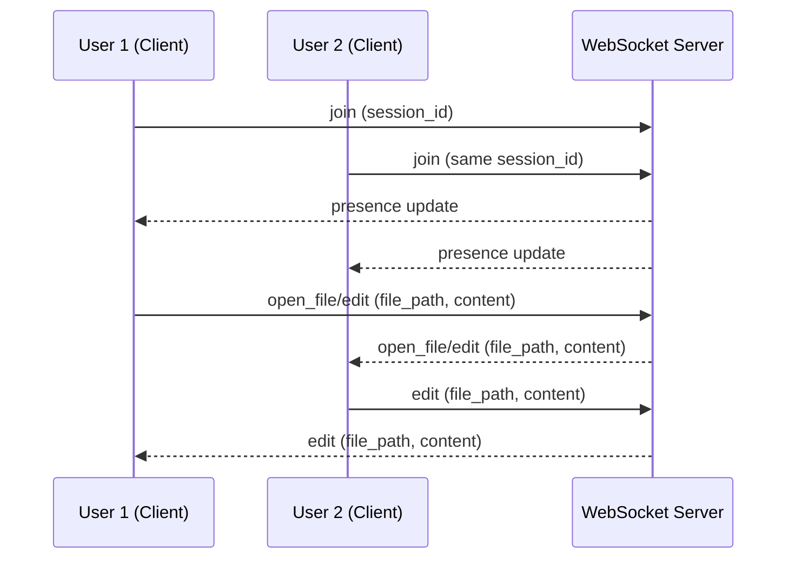
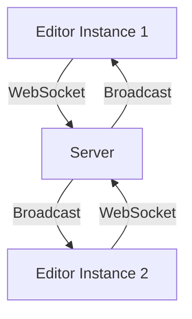
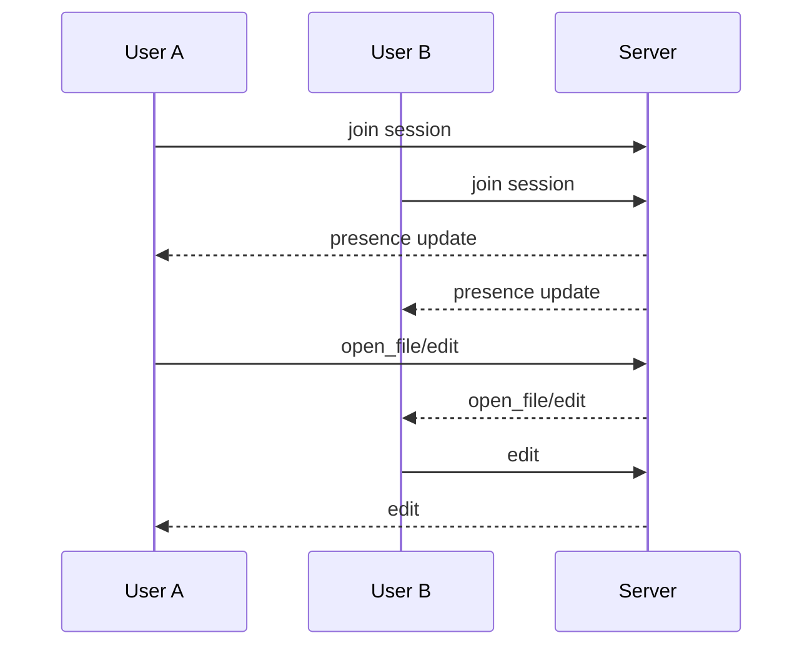

# PyCode Collaborative Editor

## Overview
PyCode is a modern, collaborative code editor built with Python, PyQt5, and QScintilla. It supports real-time multi-user editing, project navigation, syntax highlighting, and more—similar to VSCode, but with live collaboration via WebSockets.

---

## Features
- **Tabbed code editing** with syntax highlighting (Python, JS, HTML, CSS, C++)
- **File explorer** with nested folders, file/folder creation, renaming, and deletion
- **Light/dark theme** toggle
- **Find/search** in files
- **Collaborative editing**: multiple users can join a session via link and edit together in real time
- **User presence**: see who is in your session
- **Home page**: open projects, create/join sessions, see recent files
- **Safe exit**: prompts to save unsaved files before closing
- **Flicker-free, multi-file collaboration**

---

## Architecture

### High-Level Diagram
```mermaid
graph TD
    subgraph Client (PyQt5 App)
        A[Home Page] -->|Create/Join| B[Editor UI]
        B --> C[WebSocket Client]
        B --> D[File Explorer]
        B --> E[Code Editor Tabs]
    end
    subgraph Server (collab_server.py)
        F[WebSocket Server]
        F -->|Broadcast| G[Session State]
    end
    C <--> F
```

### Collaboration Flow


---

## Installation & Usage

### 1. Clone the repo
```sh
git clone <repo-url>
cd chat_module
```

### 2. Install dependencies
```sh
pip install -r requirements.txt
```

### 3. Start the collaboration server
```sh
python collab_server.py
```

### 4. Start the editor (in one or more terminals)
```sh
python code_editor.py
```

---

## Main Modules & Functions

### `code_editor.py`
- **MainWindow**: The main PyQt5 window, manages tabs, file explorer, collaboration, and UI.
    - `create_session` / `join_session`: Start or join a collaborative session.
    - `start_collab_client`: Connects to the WebSocket server, manages signals.
    - `on_collab_message`: Handles incoming WebSocket messages (edit, open_file, presence).
    - `apply_collab_update`: Updates the editor for remote edits, flicker-free.
    - `apply_collab_open_file`: Opens/switches files when a remote user opens a file.
    - `update_presence`: Updates the status bar with the list of users in the session.
    - `on_editor_text_changed_collab`: Sends edits to the server (only for the current file).
    - `open_file_by_path`: Opens a file and broadcasts to the session if in collaboration mode.
    - `connect_editor_signal`: Ensures the correct tab's editor is connected for collaboration.
- **FileExplorer**: QTreeView-based file/folder browser with context menu for file/folder ops.
- **CodeEditor**: QScintilla-based code editor with syntax highlighting, autocompletion, and tooltips.
- **HomePage**: The landing page for opening projects, files, or starting/joining sessions.

### `collab_server.py`
- **handler**: Handles WebSocket connections, manages sessions, broadcasts edits, file opens, and user presence.
- **broadcast_presence**: Sends the current user list to all clients in a session.

---

## Known Issues & Problems Faced

### 1. **WebSocket API changes**
- The `websockets` library changed its handler signature in v11+. We updated the server to use the new API (`handler(websocket)` instead of `handler(websocket, path)`).

### 2. **Thread safety in PyQt**
- Directly updating Qt widgets from the WebSocket thread caused segmentation faults. We fixed this by using `pyqtSignal` to update the UI from the main thread.

### 3. **Flicker and cursor jumps**
- Naive full-text replacement on every edit caused flicker and cursor jumps. We now only update if the content is different and preserve the cursor position.

### 4. **Multi-file sync**
- Early versions only synced the current tab. Now, file opens and edits are broadcast with file paths, so all users stay in sync across multiple files.

### 5. **Presence tracking**
- Added user presence broadcast and display in the status bar.

---

## Solutions Tried

| Problem | Solution | Result |
|---------|----------|--------|
| WebSocket API mismatch | Updated handler signature | Success |
| Segmentation fault | Used `pyqtSignal` for thread-safe UI updates | Success |
| Editor flicker | Only update if content changes, preserve cursor | Success |
| Multi-file sync | Broadcast file_path with edits/opens | Success |
| User presence | Broadcast and display user list | Success |

---

## Graphs & Diagrams

### Architecture


### Collaboration Flow


---

## How to Contribute
- Fork the repo, create a branch, and submit a pull request.
- Please open issues for bugs or feature requests.

---

## Credits
- Built with [PyQt5](https://riverbankcomputing.com/software/pyqt/), [QScintilla](https://riverbankcomputing.com/software/qscintilla/), [websocket-client](https://github.com/websocket-client/websocket-client), and [websockets](https://websockets.readthedocs.io/).

---

## Contact
For questions or support, open an issue or contact the maintainer.
